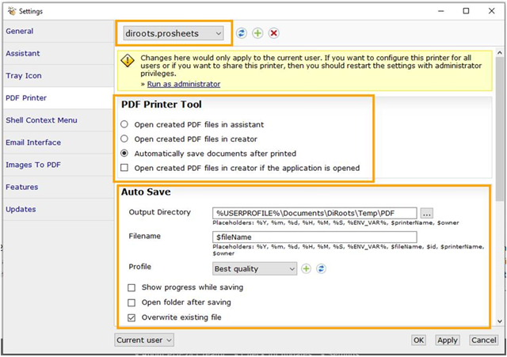

# Frequently Asked Questions about ProSheets

This section aims to answer the our users' frequently asked questions.

## Does ProSheets requires PDF24?

Yes. The correct version of PDF24 will be automatically installed alongside ProSheets.

```
Uninstalling PDF24 will lead ProSheets to stop working.
```

## Can I select another PDF printer?

No. ProSheets works only with PDF24.

## What is the printer called diroots.prosheets that I got after installing ProSheets?

diroots.prosheets printer is a custom instance of PDF24 that ProSheets uses to set up its custom settings without affecting the main instance of PDF24.

## Why I can't see the PDFs being created in the output location?

If you don't see the PDF files appearing in the export path, it means that there are some issues with your settings. You can fix it, using one of the methods below.

**Method A**  

Open PDF24 -> Settings -> Printer Driver and confirm that your settings are as per the image below.

  

**Method B**  

1. uninstall ProSheets and PDF24
2. download and install the [latest version of ProSheets](https://diroots.com/revit-plugins/revit-to-pdf-dwg-dgn-dwf-nwc-ifc-and-images-with-prosheets/) from our website.
3. restart your computer and try again 

## Why I ProSheets tells me that my printer is in an error state?

If ProSheets is telling you that your printer is in error state, it means that the Windows printer services stopped working.  
Often, restart your computer is enough to fix the problem.

