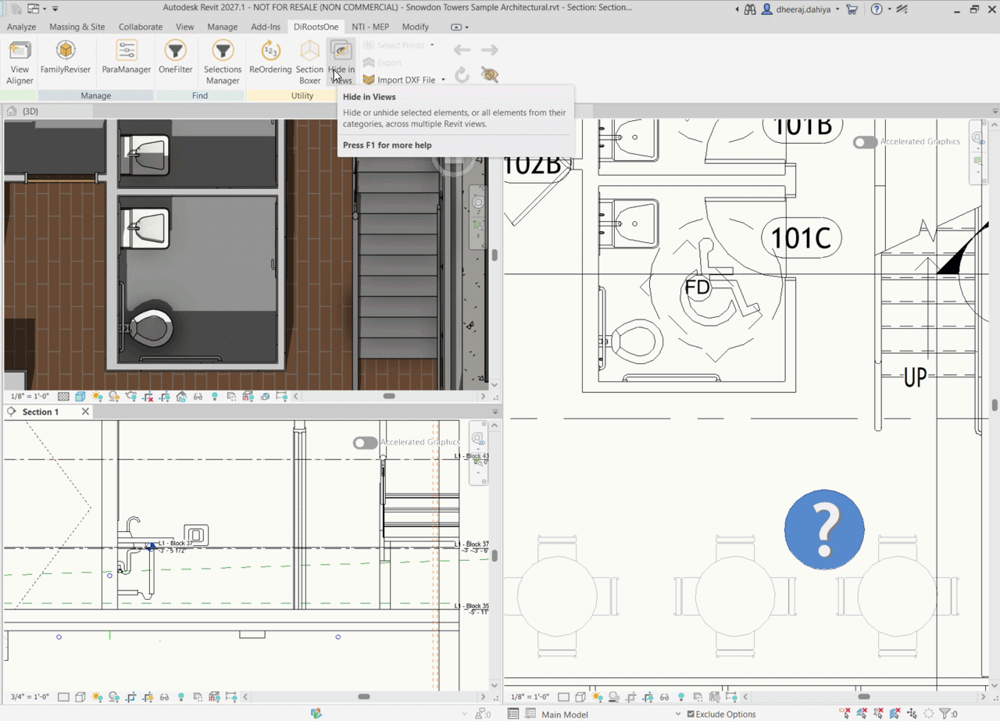

# Hide in Views
{: .no_toc }
Hide or unhide selected Revit elements, or their categories, across multiple views in a single operation.

## Table of contents
{: .no_toc .text-delta }

1. TOC
{:toc}

---

# Hide in Views

Hide in Views allows you to quickly hide or unhide selected elements or their categories across multiple Revit views without updating each view individually.

You can work with either the selected Revit elements or the categories belonging to those elements, and then choose the views where the Hide or Unhide action should be applied.

## Select Elements

Steps:

1. Select one or more elements in your Revit project.
2. Open Hide in Views from the "Utilities" panel on the "DiRootsOne" tab.

```yaml
# Note:
If no elements are selected, Hide in Views prompts you to select elements before the tool opens.
```

## Choose Elements or Category

Choose whether to control the visibility of the selected elements or their categories.

- **Elements** - Hides or unhides only the elements currently selected in Revit.
- **Category** - Hides or unhides the unique categories of the selected elements through Revit Visibility/Graphics.

The status bar at the bottom of the window displays **Selected Views** and either **Selected Elements** in Elements mode or **Categories Collected** in Category mode.

```yaml
# Note:
Category mode uses Revit Visibility/Graphics category visibility. It does not hide the individual elements.
```

## Select Target Views

Select one or more views where you want to apply the Hide or Unhide action using their checkboxes.

Use the available controls to filter and more easily find and select target views:

- **Search** - Searches views by name.
- **View Type** - Filters the list by supported view type: Area Plans, Ceiling Plans, Elevations, Floor Plans, Sections and 3D Views.
- **Header checkbox** - Selects or deselects all the currently displayed views.
- **Column headers** - Sorts the available views.

The currently active Revit view is marked with an "Active" label.

### Views with View Templates

In Category mode, views with an applied view template cannot be selected because category visibility is controlled by the template. Switch to Elements mode to hide or unhide individual elements in those views.

## Refresh

While Hide in Views is open, you can change the selected elements or project views in Revit. Click "Refresh" to update Hide in Views with the current Revit state.

"Refresh" performs the following actions:

- Updates the selected elements or collected categories.
- Reloads supported views and reevaluates the active-view and view-template states.
- Preserves the selected mode and any target views that remain valid.

## Hide or Unhide

Choose an action:

- **Hide** - Hides the selected elements or collected categories in the selected views, according to the active mode.
- **Unhide** - Unhides the selected elements or collected categories in the selected views, according to the active mode.

In Elements mode, Hide and Unhide use Revit element-level visibility.

  
<sub>**Note:** the version shown in the GIF may not reflect the [latest version of Hide in Views/DiRootsOne](https://diroots.com/revit-plugins/dirootsone/).</sub>

In Category mode, Hide and Unhide turn the collected categories off or on through Revit Visibility/Graphics.

```yaml
# Note:
Unhide reverses only the element-level or category-level visibility controlled by the active mode. Elements may remain invisible if other Revit visibility settings or view conditions affect them.
```

  
<sub>**Note:** the version shown in the GIF may not reflect the [latest version of Hide in Views/DiRootsOne](https://diroots.com/revit-plugins/dirootsone/).</sub>

  
<sub>**Note:** the version shown in the GIF may not reflect the [latest version of Hide in Views/DiRootsOne](https://diroots.com/revit-plugins/dirootsone/).</sub>

When the operation starts, a separate progress dialog displays the execution progress.

After the operation is complete, a report displays the execution results.

The Hide in Views window remains open after the operation. Select different target views to repeat the operation, or change the Revit selection, click **Refresh**, and run another operation.

## Undo Considerations

Revit Undo reverses the entire Hide or Unhide batch operation, not individual views. If you perform other Revit actions after Hide or Unhide, multiple Undo steps may be required to return to the operation.
