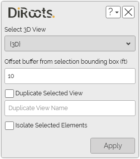
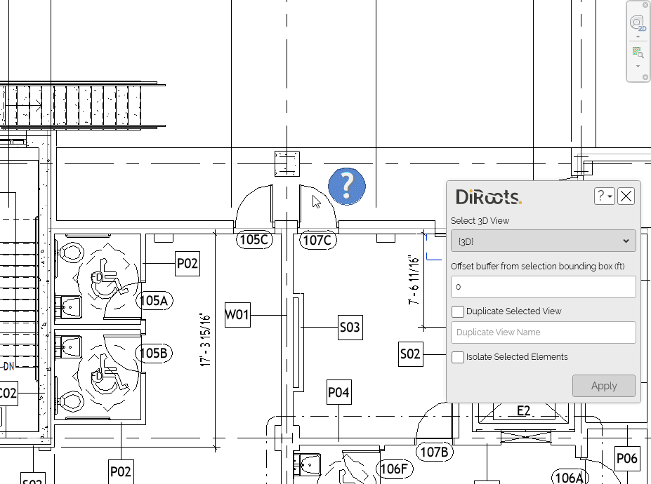

# SectionBoxer
{: .no_toc }
Quickly create a section box from selected elements, with a buffer and optionally into a new view, to help you better inspect or manipulate those elements in isolation.
## Table of contents
{: .no_toc .text-delta }

1. TOC
{:toc}

---

# SectionBoxer

This tool allows you to create a section box from the selected elements. To use it, follow these steps:

1. Open SectionBoxer from the DiRootsOne tab or the Modify tab.
   
3. Select elements in your model, you can also select them before opening the tool.
   
   Note: the version on the image may not reflect the [latest version of SectionBoxer/DiRootsOne](https://diroots.com/revit-plugins/dirootsone/).
   
4. Configure the available options before applying:
   - Select 3D View: Choose the 3D view to apply the section box, or to be duplicated.
   - Offset Buffer: Add a buffer around the bounding box of the selected elements (in project units).
   - Duplicate Selected View: Create a new view before applying the section box, keeping the original view unchanged. The tool will automatically suggest a name (e.g. “3D Copy 01”).  
   - Isolate Selected Elements: Apply a temporary Isolate to the selected elements in the target view.

5. Click Apply to create the section box from the aggregate bounding box of the selected elements.

Note: The tool saves your settings on close and restores them on next launch.

  
Note: the version on the image may not reflect the [latest version of SectionBoxer/DiRootsOne](https://diroots.com/revit-plugins/dirootsone/).
