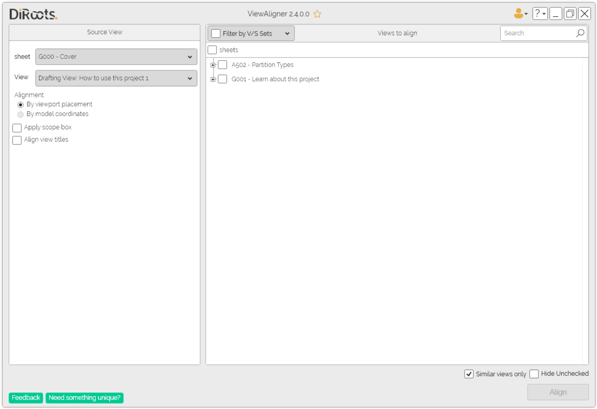
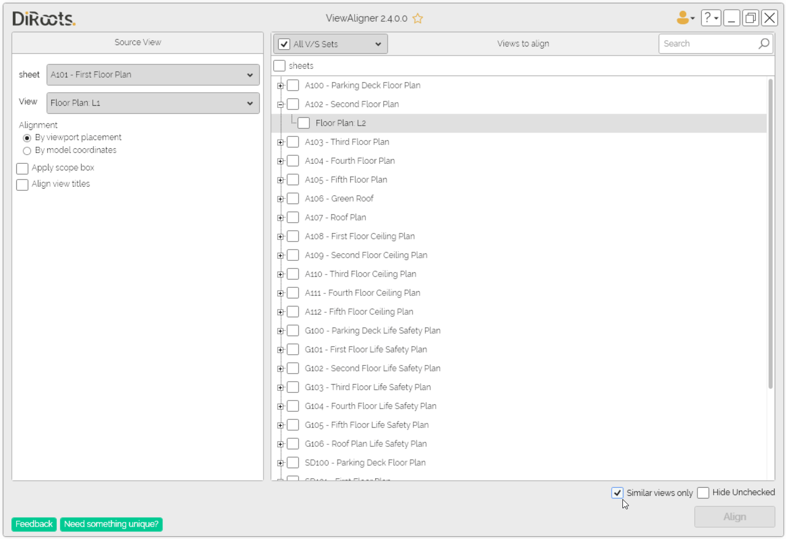

# ViewAligner
{: .no_toc }
Easily replicate the alignment of a reference view across multiple sheets to quicky achieve consistent sheet layouts.
## Table of contents
{: .no_toc .text-delta }

1. TOC
{:toc}

---

# ViewAligner
ViewAligner streamlines the process of positioning views across Revit sheets by using a reference view as a template. This ensures consistent layouts, reduces manual adjustments, and helps teams maintain drawing standards efficiently. The tool supports all Revit view types placed on sheets, including floor plans, RCPs, structural plans, sections, elevations, 3D views, legends, schedules, and drafting views. With flexible alignment modes and options for scope box and view title consistency, ViewAligner makes sheet management both faster and more reliable.  

## Select the Source View
- If the active view is a sheet, the sheet and its first view will be preselected automatically.  
- If no sheet is active, you can manually select a sheet and a reference view from the dropdown menus.  

  
Note: the version on the image may not reflect the [latest version of SectionBoxer/DiRootsOne](https://diroots.com/revit-plugins/dirootsone/).

## Alignment Options
- Align by Viewport Placement – Uses the position of the viewport on the sheet, applicable to all view types.  
- Align by Model Coordinates – Uses the actual model coordinates to align plan-based views (e.g., floor plans, RCPs).  
- Apply Scope Box – Copies the scope box of the reference view to all selected views, maintaining consistent crop regions.  
- Align View Titles (Revit 2022 and later) – Applies the same style, position, and line length of the reference view title to all target views.  

## Select Views to Align
- A list of sheets and their views is displayed, with the same browser organization as selected in Revit
- Filter by V/S Sets - if you have organized the project sheets into sets, you can apply filters to make the work process easier.
- Use the search bar to quickly locate views and select them for alignment.  
- “Similar Views Only” - Shows only views that are considered similar (checked by default)
  - Similar views are those with the same type and same scale as the reference view 
  - Plan views (floor/ceiling/structural) are considered similar view types.  
  - Drafting views are always considered similar regardless of scale.  
  "Hide Unchecked" - Hides the unchecked sheets to allow you to preview only the views and sheets that will be aligned

  
Note: the version on the image may not reflect the [latest version of SectionBoxer/DiRootsOne](https://diroots.com/revit-plugins/dirootsone/).
