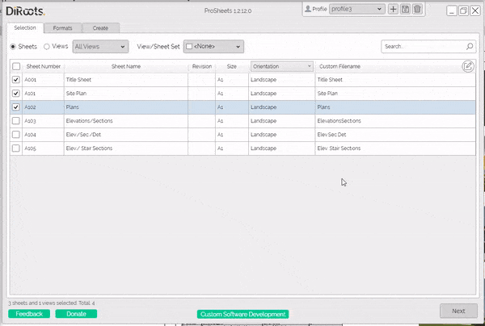
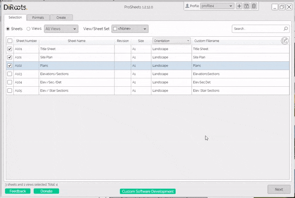
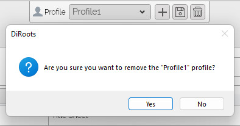

# Profiles
{: .no_toc }

## Table of contents
{: .no_toc .text-delta }

1. TOC
{:toc}

---

## What's saved in the profile

The following settings are saved in the profiles.
- Naming rules
- Export settings (for PDF, DWG, DGN, DWF, NWC, IFC, and Images)

## Creating Profiles

ProSheets profiles make it easy to save your settings and reuse them later. It is also a handy way for BIM Managers to create standard rules (e.g., filename conventions) and share them across the organization.

Steps:
1. In the window header, click on the plus (+) button next to the profiles list.
2. Name the profile (give it a meaningful name because this is the name that will show up in the profiles list)
3. Choose if you want to create a profile with the default ProSheets settings, with your current settings, or import settings from an existing profile.
4. Click on the "Create" button to create the profile.

  
<sub>Note: the version on the image may not reflect the [latest version of ProSheets](https://diroots.com/revit-plugins/revit-to-pdf-dwg-dgn-dwf-nwc-ifc-and-images-with-prosheets/).</sub>

```
Tip for BIM Managers!  

Create the profiles in a network location to allow other users to import them.
See the "Importing Profiles" section to teach users how to pull profiles from a network location.
```

## Importing Profiles

ProSheets profiles make it easy to import existing profiles to stay compliant with your company standards (e.g., profiles in a network location).

Steps:
1. In the window header, click on the plus (+) button next to the profiles list.
2. Name the profile (give it a meaningful name because this is the name that will show up in the profiles list)
3. Choose 'Import from file' to import settings from an existing profile
4. Use the Windows File Explorer to find the profile (e.g., in a shared folder, location network, or local computer)
5. Click on the "Create" button to create the profile.

  
<sub>Note: the version on the image may not reflect the [latest version of ProSheets](https://diroots.com/revit-plugins/revit-to-pdf-dwg-dgn-dwf-nwc-ifc-and-images-with-prosheets/).</sub>

## Deleting Profiles

Steps:
1. In the window header, select the from the dropdown the profile you want to delete
2. Click on the dustbin icon next to the profiles list.
3. Confirm.

  