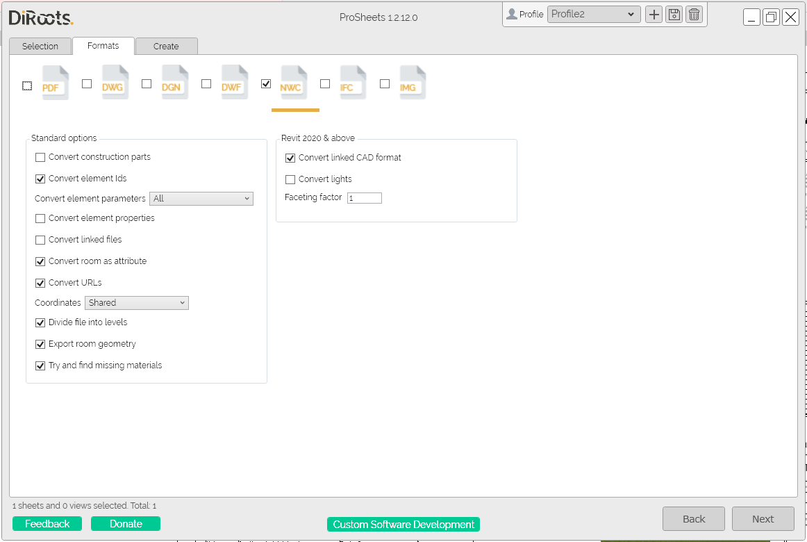

# Formats Tab
{: .no_toc }

## Table of contents
{: .no_toc .text-delta }

1. TOC
{:toc}

---

## Supported File Formats

ProSheets allows you to batch Export Sheets/Views to PDF, DWG, DGN, DWF, NWC, IFC, and IMG (JPEG, PNG, TIFF)

  
Note: the version on the image may not reflect the [latest version of ProSheets](https://diroots.com/revit-plugins/revit-to-pdf-dwg-dgn-dwf-nwc-ifc-and-images-with-prosheets/).
## PDF Settings

ProSheets uses the Revit engine and a custom instance of PDF24 printer (diroots.prosheets printer) to export to PDF. ProSheets supports all Revit to PDF options plus some additional handy features.

  
Note: the version on the image may not reflect the [latest version of ProSheets](https://diroots.com/revit-plugins/revit-to-pdf-dwg-dgn-dwf-nwc-ifc-and-images-with-prosheets/).
Supported settings:
- **all PDF Revit settings** (paper placement, oritantion, zoom, vector and raster processing, etc.)
- additional settings for combined PDFs
    - order views and sheets
    - different page sizes in the same PDF
	
	**Note:** the additional settings work only if the 'Keep jumped to section' checkbox is unchecked.  
	
	  

## DWG Settings

ProSheets uses the Revit engine to export to DWG. All the DWG settings will be read from the DWG export setups created in Revit.

Steps:
1. In Revit UI go to File -> Export -> DWG and create a new DWG/DXF export setup as per your requirements (if you don't know how to create/modify a DWG/DXF setup, read this [article](https://knowledge.autodesk.com/support/revit/learn-explore/caas/CloudHelp/cloudhelp/2019/ENU/Revit-DocumentPresent/files/GUID-E8443B4B-D55B-4630-BEE3-D2D8628CA17B-htm.html))
2. Use the dropdown to switch between the existing DWG setups. If you created the setup with ProSheets opened, you may need to close and reopen it to see the new setup in the list.  

  
Note: the version on the image may not reflect the [latest version of ProSheets](https://diroots.com/revit-plugins/revit-to-pdf-dwg-dgn-dwf-nwc-ifc-and-images-with-prosheets/).

## DGN Settings

ProSheets uses the Revit engine to export to DGN. All the DGN settings will be read from the DGN export setups created in Revit.

Steps:
1. In Revit UI go to File -> Export -> DGN and create a new DGN export setup as per your requirements (if you don't know how to create/modify a DGN setup, read this [article](https://knowledge.autodesk.com/support/revit/learn-explore/caas/CloudHelp/cloudhelp/2021/ENU/Revit-DocumentPresent/files/GUID-253B99CA-09C0-456E-B260-E69F5C14F793-htm.html))
2. Use the dropdown to switch between the existing DGN setups. If you created the setup with ProSheets opened, you may need to close and reopen it to see the new setup in the list.  

  
Note: the version on the image may not reflect the [latest version of ProSheets](https://diroots.com/revit-plugins/revit-to-pdf-dwg-dgn-dwf-nwc-ifc-and-images-with-prosheets/).

## DWF Settings

ProSheets uses the Revit engine to export to DWF/DWFx. ProSheets supports and exposes in its UI all Revit to DWF/DWFx export options.

  
Note: the version on the image may not reflect the [latest version of ProSheets](https://diroots.com/revit-plugins/revit-to-pdf-dwg-dgn-dwf-nwc-ifc-and-images-with-prosheets/).
## NWC Settings

ProSheets uses the Autodesk Navisworks NWC Export Utility to export to NWC. You must install the [Autodesk Navisworks NWC Export Utility](https://www.autodesk.com/products/navisworks/3d-viewers) (if it's not yet installed).

  
Note: the version on the image may not reflect the [latest version of ProSheets](https://diroots.com/revit-plugins/revit-to-pdf-dwg-dgn-dwf-nwc-ifc-and-images-with-prosheets/).
## IFC Settings

ProSheets uses the Revit engine to export to IFC. ProSheets supports and exposes in its UI all Revit to IFC export options.

  
Note: the version on the image may not reflect the [latest version of ProSheets](https://diroots.com/revit-plugins/revit-to-pdf-dwg-dgn-dwf-nwc-ifc-and-images-with-prosheets/).
## Images and HTML Settings

ProSheets uses the Revit engine to export to Images and HTML. ProSheets supports and exposes in its UI all Revit to Images and HTML export options.

  
Note: the version on the image may not reflect the [latest version of ProSheets](https://diroots.com/revit-plugins/revit-to-pdf-dwg-dgn-dwf-nwc-ifc-and-images-with-prosheets/).
