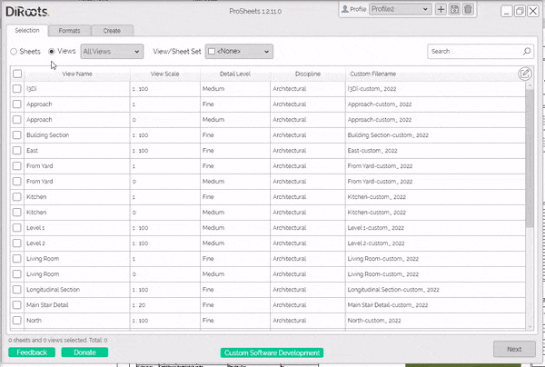
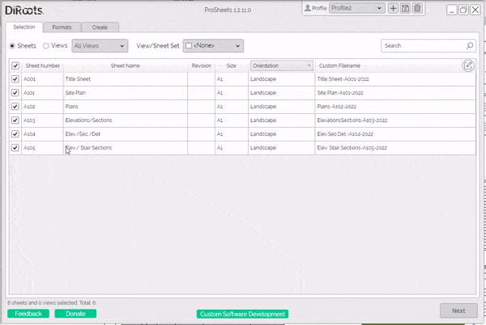
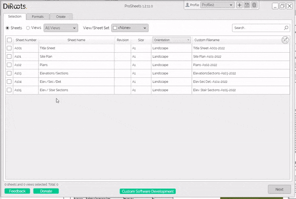
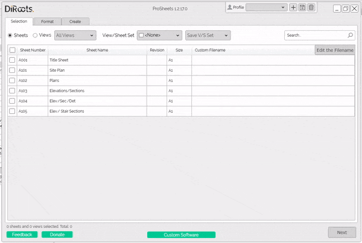
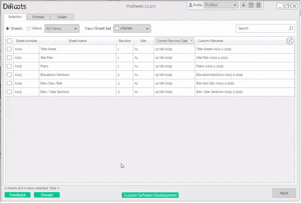
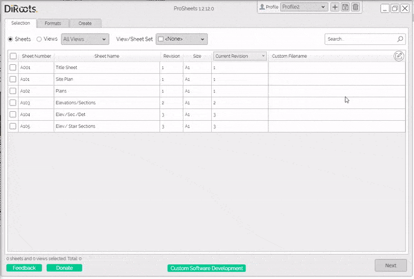

# Selection Tab
{: .no_toc }
The Selection tab is where you'll select the sheets and views to be exported and the file naming rules. ProSheets has options to sort, filter, and search to ease the selection. Plus, it has an advanced naming rule builder that allows you to customize the filenames.
## Table of contents
{: .no_toc .text-delta }

1. TOC
{:toc}

---

## Select Sheets and Views or View/Sheet Sets

The first step is to select the sheets and views to be exported.  

Steps:

1. Click radio buttons to switch between sheets and views. fsdfsdfs

```yaml
The 'Sheets' radio button will show the existing sheets in the project.  
The 'Views' radio button will show the existing views in the project.  
```

2. Use the checkboxes to select specific sheets/views or use the checkbox in the table header to select all sheets/views.

  
<sub>Note: the version on the image may not reflect the [latest version of ProSheets](https://diroots.com/revit-plugins/revit-to-pdf-dwg-dgn-dwf-nwc-ifc-and-images-with-prosheets/).</sub>

---

## Sort, Filter and Search

ProSheets has options to sort, filter, and search to ease the selection.

### Sort

Click on the table headers to sort the views/sheets by one of the available parameters.  


```yaml
# Note:  
The 5th column in sheet list contains a dropdown that allows you select to any other instance parameter available on your sheets.  
Examples - Current Review Date, Approved By, Appears on Sheet List, etc. 
The default is Orientation.
```
  

  
<sub>Note: the version on the image may not reflect the [latest version of ProSheets](https://diroots.com/revit-plugins/revit-to-pdf-dwg-dgn-dwf-nwc-ifc-and-images-with-prosheets/).</sub>


### Filter

Filtering options available:
1. Radio button to switch between sheets and views
2. Dropdown to filter by view type (e.g., 3D, Floor Plan, Section, Detail, etc.)
3. Dropdown with checkboxes to filter by view/sheet sets.
4. Context menu to add/remove columns

  
<sub>Note: the version on the image may not reflect the [latest version of ProSheets](https://diroots.com/revit-plugins/revit-to-pdf-dwg-dgn-dwf-nwc-ifc-and-images-with-prosheets/).</sub>

You can use the context menu to add/remove columns to/from the table view.

  
<sub>Note: the version on the image may not reflect the [latest version of ProSheets](https://diroots.com/revit-plugins/revit-to-pdf-dwg-dgn-dwf-nwc-ifc-and-images-with-prosheets/).</sub>

### Search

The search box will search for text contained in any of the existing columns (including the customizable column).  
  
---

For example, you can find Sheets by:
- Sheet Number
- Sheet Name
- Revision
- Size (e.g., A1, A0, etc.)
- Any instance parameter available in the customizable column
- Custom filename

---

For example, you can find Views by:
- View Name
- Scale
- Detail Level
- Discipline
- Custom filename

  
<sub>Note: the version on the image may not reflect the [latest version of ProSheets](https://diroots.com/revit-plugins/revit-to-pdf-dwg-dgn-dwf-nwc-ifc-and-images-with-prosheets/).</sub>

---

## Naming Rules

The custom filename builder allows you to quickly set how you want your files to be named.

Main features:
- Parametric filenaming (using Sheet/View and Project Information parameters)
- Set generic field separator (e.g., SheetName-ShetNumber)
- Set custom fields Separators (e.g., SheetName-ShetNumber_Rev1)
- Custom static fields  (e.g., SheetName-ShetNumber-MyStaticField)
- Other non-Revit parameters (e.g., Current Month, Day, Hour, etc.)

  
<sub>Note: the version on the image may not reflect the [latest version of ProSheets](https://diroots.com/revit-plugins/revit-to-pdf-dwg-dgn-dwf-nwc-ifc-and-images-with-prosheets/).</sub>

---